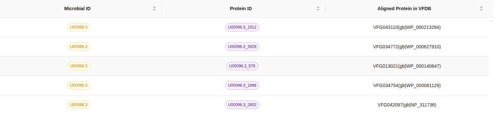

# How to perform MicrobialScope Analysis

MicrobialScope provides user-friendly online analysis workflows designed to facilitate efficient study of customized genome sequences. These workflows include comprehensive pipelines for both genome annotation and comparative genome analysis. To begin, simply click on the ``Analysis`` tab in the navigation bar and follow the guided steps to upload your data and explore the available tools.

## Input Overview
Users can easily navigate to the desired analysis module using the menu on the left-hand side of the screen. To help users get started, the platform offers the option to run demo datasets or to directly access and explore demo results, providing a clear understanding of the workflow and expected outputs. Example input files are also provided for reference. On the main page, users should choose the type of microorganism to be analyzed and upload one or more genome sequences as required to initiate the analysis. This streamlined setup ensures a smooth and intuitive experience for exploring microbial genome data.

## Output Overview
After submitting an analysis task, users can click ``Workspace`` on the navigation bar to monitor its progress. Once the task is completed, the status will change from ``Running`` to ``Success``. At that point, users can click the ``view result``  button to access the prepared results from the selected modules. The results page provides an overview of the analysis task, along with downloadable result tables, detailed information about the analyzed sequences, corresponding analysis outputs, and visualizations.

### ORF Prediction & Protein Classification
The **ORF Prediction & Protein Classification** module provides **4** downloadable files — Protein Information, Gene Sequence, Protein Sequence, and the GFF3 file. Together, these files correspond to the **Annotated Protein List** and the **Annotated Protein Map**, offering comprehensive details on the predicted proteins, their sequences, and functional annotations. This information allows users to thoroughly examine the identified proteins and apply the results for subsequent research or analytical purposes.

### tRNA & tmRNA Prediction
The **tRNA & tmRNA Prediction** module provides **1** downloadable files (tRNA FASTA). Together, these files correspond to the **Annotated tRNA & tmRNA List** and the **Annotated tRNA & tmRNA Map**. This file contains detailed information on the predicted tRNA sequences and their annotations, enabling users to explore the identified tRNAs in depth and utilize the data for further biological or functional analysis.

### Virulence Factor & Antibiotic Resistance Gene Detecion
The **Virulence Factor & Antibiotic Resistance Gene Detecion** module provides **2** downloadable files — the VF results file and the ARG results file. These files collectively correspond to the **Annotated Virulence Factor List**, the **Annotated Virulence Factor Map**, **Annotated Antibiotic Resistance Gene List**, and the **Annotated Antibiotic Resistance Gene Map**, offering comprehensive information on the identified virulence factors and antibiotic resistance genes. This enables users to thoroughly examine the genetic determinants of pathogenicity and antimicrobial resistance, supporting further research and functional analysis.

### Transmembrane Protein Annotation
The **Transmembrane Protein Annotation** module provides **2** downloadable files — the original results file and the organized results file. These files together correspond to the **Annotated Transmembrane Protein List** and the **Annotated Transmembrane Protein Map**, providing detailed information on the predicted transmembrane proteins and their annotations. This allows users to conveniently review, interpret, and apply the results in subsequent structural, functional, or comparative analyses.

### Sequence Alignment
The **Sequence Alignment** module provides **2** downloadable files — the BLAST results file and the Alignment results file. Combined, these files form the **Alignment Result List**, presenting comprehensive details of sequence alignment outcomes. They enable users to examine sequence similarities, identify homologous regions, and perform in-depth comparative analyses, thereby supporting a wide range of genomic and functional studies.

  

### Comparative Analysis
The **Comparative Analysi** module provides **2** downloadable files — the Comparative Tree results file and the Alfree results file. Together, these files constitute the **Comparative Tree**, which visually represents evolutionary relationships and genetic similarities among the analyzed sequences. By providing both tree-based and alignment-free comparison data, this module enables users to conduct comprehensive phylogenetic analyses and gain deeper insights into the genetic relatedness of different organisms or strains.

  

