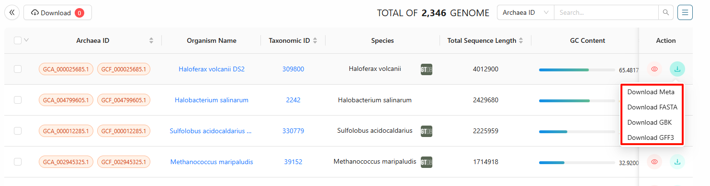
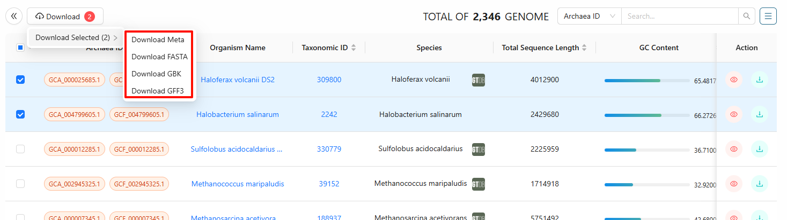
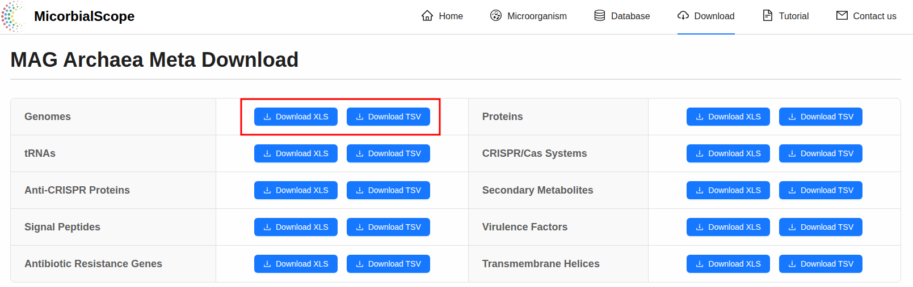

# How to download MicrobialScope datasets

## Microorganisms Sequence Download

The `Download`` button in the ``Genome`` interface enables Users retrieval of microbial genomic sequences and associated genome information in desired file with standardized formats.
 

Users could also select multiple sequences at the same time and slide the mouse to the ``Download`` button to select the desired data format for downloading. Microbial sequences and information are provided in **FASTA**, **GFF3**, **GBK**, and **tabular** (Meta data) format. 

## Meta Data Download
MicrobialScope also offers ``Download`` interface for users to retrieve data, including the microbial metadata of genome, protein, tRNA & tmRNA, CRISPR/Cas system, anti-CRISPR protein, secondary metabolite, signal peptide, virulence factor, antibiotic resistance gene, and transmembrane protein. Users could click ``Download XLS`` or ``Download TSV`` button to directly batch download the required files.

### Genome Meta Data Download
The metadata for all the **2,644,445** genomes. The table columns represent the following:

+ ``Archaea\_ID`` or ``Bacteria\_ID`` or ``Fungi\_ID`` or ``Viruses\_ID``: archaea or bacteria or fungi or viruses ID
+ ``Organism Name``: name for microbial organism
+ ``Taxonomic ID``: NCBI Taxonomic ID for microbial organism
+ ``Species``: species for microbial organism
+ ``Total Sequence Length``: microorganism total sequence length
+ ``GC content``: microorganism GC content
+ ``Assembly Level``: assembly level for microbial sequence
+ ``Total Number of Chromosomes``: total number of chromosomes obtained by microbial sequence assembly
+ ``Contig N50``: N50 of microbial sequence assembly contig
+ ``Scaffold N50``: N50 of microbial sequence assembly scaffold

### Protein Meta Data Download
The metadata for all the **1,072,114,935** proteins. The table columns represent the following:

Each row gives the information for a protein; The columns give information about plasmid ID (Plasmid\_ID), the protein source (Orf Prediction Source), the annotation source (Function Prediction Source), the protein start site on the genome (Start), the protein stop site on the genome(End), the strand encoding the protein (Strand), protein ID (Protein\_ID), protein product (Product), protein classification with COG category (COG\_category), annotation of EC number (EC\_number), annotation of COG ID (COG\_id), annotation of GO database (GOs), annotation of KEGG database (KEGG\_ko, KEGG\_Pathway, KEGG\_Module, KEGG\_Reaction, KEGG\_rclasss, BRITE, KEGG\_TC), annotation of CAZy database (CAZy), annotaion of  BiGG database (BiGG\_Reaction), annotation of Pfam database (PFAMs), the protein sequence (Sequence), and the plasmid source dataset (Source).

#### tRNA & tmRNA Meta Data Download
The metadata for all the **24,640,186** tRNAs & tmRNAs. The table columns represent the following:

Each row gives the information for a t(m)RNA gene; The columns give information about the plasmid ID (Plasmid\_ID), t(m)RNA ID (tRNA\_ID), the t(m)RNA type (tRNA Type), the t(m)RNA start site on the genome (Start), the t(m)RNA stop site on the genome (End), the strand (Strand), the length of t(m)RNA (Length), and the t(m)RNA sequence (Sequence).

#### CRISPR/Cas System Meta Data Download
The metadata for all the **140,888** CRISPR/Cas systems. The table columns represent the following:

Each row gives the information for a CRISPR/Cas systems; The columns give information about the Plasmid\_ID, Cas\_ID,  Cac\_start, Cac\_end, the subtype of Cas (Cas\_Subtype), CRISPR\_ID, CRISPR\_start, CRISPR\_end, the subtype of CRISPR (CRISPR_Subtype), the CRISPR\-Cac consenus prediction (CRISPR\-Cas Consenus Prediction), the sequence of consenus repeat (Consensus Repeat Sequence), and the Cas genes (Cas Genes).

#### Anti-CRISPR Element Meta Data Download
The metadata for all the **173,256** anti-CRISPR proteins. The table columns represent the following:

Each row gives the information for a CRISPR/Cas systems; The columns give information about the Plasmid\_ID, Cas\_ID,  Cac\_start, Cac\_end, the subtype of Cas (Cas\_Subtype), CRISPR\_ID, CRISPR\_start, CRISPR\_end, the subtype of CRISPR (CRISPR_Subtype), the CRISPR\-Cac consenus prediction (CRISPR\-Cas Consenus Prediction), the sequence of consenus repeat (Consensus Repeat Sequence), and the Cas genes (Cas Genes).

#### Secondary Metabolite Meta Data Download
The metadata for all the **105,121** secondary metabolites. The table columns represent the following:

Each row gives the information for a secondary metabolism region; The columns give information about the plasmid ID (Plasmid\_ID),  secondary metabolism region number (Region), the region start site on the genome (Start), the region stop site on the genome (End), the most similar known cluster for predicted region (Mosr similar known cluster), and the similarity among predicted region and known cluster (Similarity).

#### Signal Peptide Meta Data Download
The metadata for all the **13,235,096** signal peptides. The table columns represent the following:

Each row gives the information for a signal peptides; The columns give information about the Plasmid\_ID, Protein\_ID,  the protein start site on the genome (Start), the protein stop site on the genome(End), the strand encoding the protein (Strand), the protein product (Product), the predicted type of signal peptides (Prediction), the ration of other type of protein (OTHER), the ration of SP type of signal peptide (SP(Sec/SPI)), the ration of LIPO type of signal peptide (LIPO(Sec/SPII)), the ration of TAT type of signal peptide (TAT(Tat/SPI)), the ration of TATLIPO type of signal peptide (TATLIPO(Tat/SPII)), the ration of PILIN type of signal peptide (PILIN(Sec/SPIII)), the position of CS (CS position), and the probability of CS position (Probability of CS Position).

#### Virulence Factor Meta Data Download
The metadata for all the **3,214,983** virulence factors. The table columns represent the following:

Each row gives the information for a virulence factor; The columns give information about the Plasmid\_ID, Protein\_ID, the protein source (Orf Prediction Source), the protein start site on the genome (Start), the protein stop site on the genome(End), the strand encoding the protein (Strand), aligned protein ID in VFDB (VFSeq\_ID) aligned identity (Identity), aligned e-value (E\-value), aligned gene name in VFDB (Gene\_Name), aligned protein product in VFDB (Product), aligned VFID in VFDB (VFID), aligned virulent factor name in VFDB (VF\_Name),  aligned virulent factor full name in VFDB (VF\_FullName), aligned protein VFCID in VFDB (VFCID), VF category of aligned virulent factor classified by VFDB (Vfcategory), the characteristics of aligned virulent factor (Characteristics), and the sequence of aligned protein (Sequence).

#### Antibiotic Resistance Gene Meta Data Download
The metadata for all the **188,600,553** antibiotic resistance genes. The table columns represent the following:

Each row gives the information for an antibiotic resistance gene; The columns give information about the Pasmid_ID, Protein_ID, the protein source (Orf Prediction Source), the protein start site on the genome (Start), the protein stop site on the genome(End), the strand encoding the protein (Strand), the product of protein (Product),  RGI detection paradigm (Cut\_Off), the identifier of HSP (HSP_identifier), ARO term of top hit in CARD (Best\_Hit\_ARO), percent identity of match to top hit in CARD(Best\_identities), ARO accession of match to top hit in CARD (ARO), ARO categorization in CARD (Drug\_Class), the resistance mechanism of aligned protein (Resistance Mechanism), the AMR gene family of aligned protein (AMR Gene Family), the antibiotics of aligned protein (Antibiotic), and the aligned protein sequence (Sequence).

#### Transmembrane Protein Meta Data Download
The metadata for all the **50,811,729** transmembrane proteins. The table columns represent the following:

Each row gives the information for a transmembrane protein; The columns give information about the Plasmid\_ID, Protein\_ID, the protein start site on the genome (Start), the protein stop site on the genome(End), the strand encoding the protein (Strand), protein length (Length), the number of predicted transmembrane helices (Number of predicted TMHs), the annotation source (Source), the position of transmembrane helices (Position), the start site (start), the stop site (end), the expected number of amino acids intransmembrane helices (Exp number of AAs in TMHs), the expected number of amino acids in transmembrane helices in the first 60 amino acids of the protein (Exp number, first 60 AAs), and the total probability that the N-term is on the cytoplasmic side of the membrane (Total prob of N\-in).

