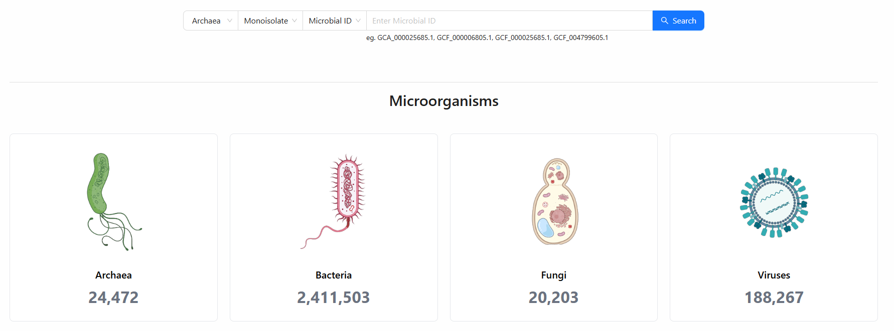

# How to explore MicrobialScope database
MicrobialScope is a comprehensive resource that provides access to microorganisms and their annotation data. In this tutorial, we will walk you through the different interfaces available on MicrobialScope database. Click Database on the navigation bar and get started.

## Overview
The ``Home`` interface offers a concise introduction to the MicrobialScope database, presenting key statistics on microbial sequences, annotated proteins, and functional elements, along with a convenient search function for querying by microbial ID pairs. 

The ``Microorganism`` interface visually displays MAG/monoisolate data distributions through intuitive bar charts, while providing comprehensive statistics on protein predictions and functional annotations across eight major categories.

## Genome

The ``Genomes`` interface allows users to access and download microbial sequences and meta information.

+ Filter: Filter for specific conditions based on user needs.
+ Detail: Access the basic information and genetic annotations of the chosen microorganisms, with interactive visualizations.  
+ Download: Download the chosen microorganisms with a user-selected data type.  

Click ``Detail`` button to access comprehensive microbial profiles, including visualized protein predictions and functional annotations presented in circular diagram.

## Protein

The ``Protein`` interface offers detailed functional and structural characterization of microbial proteins. 

+ Filter: Filter for specific conditions based on user needs.
+ Detail: Access the basic information and the predicted protein structure of the chosen proteins.  
+ Download: Download details of selected proteins.  
 
Click ``Detail`` button to access the detailed profiles of the selected proteins.

 

### tRNA & tmRNA

The ``tRNA & tmRNA`` interface provides delivers comprehensive characterization of microbial tRNAs or tmRNAs. 

+ Filter: Filter for specific conditions based on user needs.
+ Detail: Access the basic information of the chosen tRNAs or tmRNAs.  
+ Download: Download details of selected tRNAs or tmRNAs. 

Click ``Detail`` button to access the detailed profiles of the selected tRNAs or tmRNAs.

### CRISPR/Cas System

The ``CRISPR/Cas System`` interface provides delivers comprehensive characterization of microbial CRISPR/Cas systems. 

+ Filter: Filter for specific conditions based on user needs.
+ Detail: Access the basic information of the chosen CRISPR/Cas systems.
+ Download: Download details of selected CRISPR/Cas systems.

Click ``Detail`` button to access the detailed profiles of the selected CRISPR/Cas systems.

### Anti-CRISPR Element

The ``Anti-CRISPR Element`` interface delivers comprehensive characterization of microbial anti-CRISPR elements. 

+ Detail: Access the basic information of the chosen anti-CRISPR elements.
+ Filter: Filter for specific conditions based on user needs.
+ Download: Download details of selected anti-CRISPR elements.

Click ``Detail`` button to access the detailed profiles of the selected anti-CRISPR elements.

### Secondary Metabolite

The ``Secondary Metabolite`` interface delivers comprehensive characterization of microbial secondary metabolites. 

+ Filter: Filter for specific conditions based on user needs.
+ Detail: Access the basic information of the chosen secondary metabolites.
+ Download: Download details of selected secondary metabolites.

Click ``Detail`` button to access the detailed profiles of the selected secondary metabolites.

### Signal Peptide

The ``Signal Peptide`` interface delivers comprehensive characterization of microbial signal peptides. 

+ Detail: Access the basic information of the chosen signal peptides.
+ Filter: Filter for specific conditions based on user needs.
+ Download: Download details of selected signal peptides.

Click ``Detail`` button to access the detailed profiles of the selected signal peptides.

### Virulence Factor

The ``Virulence Factor`` interface delivers comprehensive characterization of microbial virulence factors. 

+ Filter: Filter for specific conditions based on user needs.
+ Detail: Access the basic information of the chosen virulence factors.
+ Download: Download details of selected virulence factors.

Click ``Detail`` button to access the detailed profiles of the selected virulence factors.

### Antibiotic Resistance Gene

The ``Antibiotic Resistance Gene`` interface delivers comprehensive characterization of microbial antibiotic resistance genes. 

+ Filter: Filter for specific conditions based on user needs.
+ Detail: Access the basic information of the chosen antibiotic resistance genes.
+ Download: Download details of selected antibiotic resistance genes.

Click ``Detail`` button to access the detailed profiles of the selected antibiotic resistance genes.

### Transmembrane Protein

The ``Transmembrane Protein`` interface delivers comprehensive characterization of microbial transmembrane proteins. 

+ Filter: Filter for specific conditions based on user needs.
+ Detail: Access the basic information of the chosen transmembrane proteins.
+ Download: Download details of selected transmembrane proteins.

Click ``Detail`` button to access the detailed profiles of the selected transmembrane proteins.

