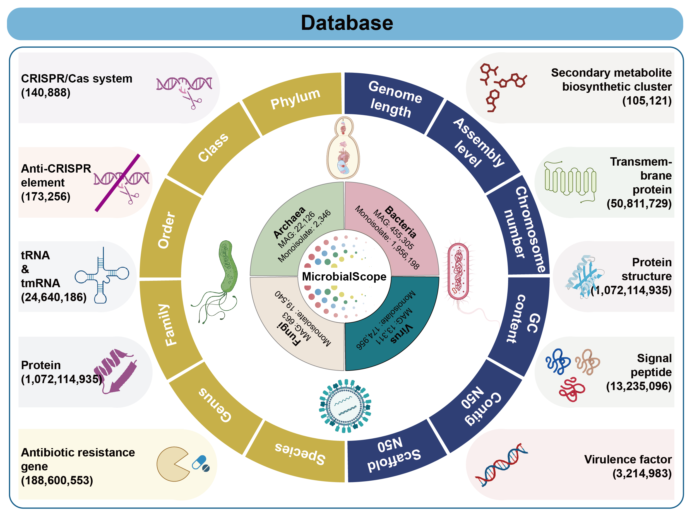
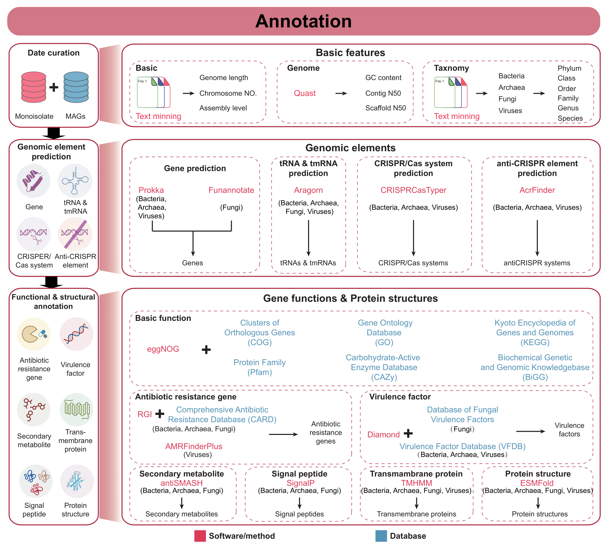

# Welcome to MicrobialScope

## Data description
MicrobialScope integrates **2,652,060** microorganisms from various databases, including **1,963,557** bacterial, **2,555** archaeal, **19,610** fungal, and **171,014** viral genomes from monoisolate assemblies, as well as **458,869** bacterial, **22,451** archaeal, **683** fungal, and **13,321** viral MAGs.

Applying multiple state-of-the-art tools to analyzing the micorbial sequences, we obtained **comprehensive annotations** for the microorganisms.

### Taxonomy information
Taxonomic information, which encompasses comprehensive data on microbial classification, genetics, physiological characteristics, and ecological roles, serves as a fundamental resource for understanding microbial diversity and functionality while facilitating significant advancements across multiple disciplines including medicine, agriculture, environmental science, and biotechnology. 

To obtain the taxonomy information, we extracted the related information from the background of microorganism **manually with text mining**. In addition, we provided the complete taxonomy ranks for the taxonomy with the information from **NCBI taxonomy database** [1].

### ORF prediction & protein annotation
ORF stands for Open Reading Frame and represents a region of DNA that has the potential to be translated into a protein. In MicrobialScope, information about ORFs and annotated proteins provides insights into the predicted genes and their corresponding proteins within the microbial genomes. These annotations are crucial for the understanding of the genetic content of microorganisms, identifying potential virulence factors, antibiotic resistance genes, secondary metabolites, etc.

For microorganisms lacking pre-existing annotations in **RefSeq**[2] or **GenBank**[3], we first performed structural annotation using **Prokka** [4] to identify bacterial, archaeal, and viral ORFs, while employing **Funannotate** [5] for fungal ORF detection. Subsequently, we conducted functional annotation through **eggNOG-mapper** [6], which provides high-confidence protein function predictions by identifying direct homologs and leveraging phylogenetic relationships. This systematic approach enabled us to categorize the annotated proteins into 26 functionally distinct classes, including carbohydrate transport and metabolism, post-translational modification systems, cell cycle control mechanisms, energy production pathways, and various other essential biological processes. The resulting annotations offer consistent and biologically meaningful characterization of microbial proteins, significantly enhancing the utility of our database for comparative genomic analyses and functional studies.

### Virulence factors and antibiotic resistance genes
Virulence factors (VFs), as pathogenic molecules that facilitate microbial invasion, immune evasion, and host nutrient acquisition, work synergistically with antibiotic resistance genes (ARGs), which confer survival advantages against antimicrobial agents to significantly enhance bacterial adaptability, pathogenicity, and persistence, thereby accelerating the spread of infectious diseases while simultaneously challenging clinical treatment efficacy through compounded pathogenic mechanisms.

MicrobialScope employs **Diamond** [7] as its core alignment tool to systematically identify virulence factors (VFs) across bacteria, archaea, and viruses using **Virulence Factor Database (VFDB)** [8] as reference, while utilizing the specialized Database of **Database of Virulence Factors in Fungal Pathogens (DFVF)** [9] for fungal pathogen characterization, enabling comprehensive classification of VFs into functional categories such as host invasion mechanisms, immunomodulation strategies, and adhesion proteins; furthermore, the platform integrates the **Resistance Gene Identifier (RGI)** [10] with the **Comprehensive Antibiotic Resistance Database (CARD)** [11] to identify and categorize resistance determinants into **70 distinct classes** covering major antimicrobial agents such as cephalosporins, fluoroquinolones, and aminoglycosides, providing researchers with a robust platform for concurrent pathogenicity and resistance analysis.

### tRNA & tmRNA
tRNA (transfer RNA) and tmRNA (transfer-messenger RNA) on microorganisms play significant roles in enhancing protein synthesis, maintaining translational efficiency, and ensuring cellular quality control. Their presence can confer a variety of physiological advantages to the host, including protein production enhancement, stress response, and genetic flexibility, which contribute to microbial adaptability and survival in diverse environments.

MicrobialScope applied **ARAGORN** [12] to detect tRNA and tmRNA genes in microbial sequences, which is the most robust tool for tRNA identification and for correctly identifying the ends of tRNAs.

### CRISPR/Cas systems
The CRISPR/Cas system (Clustered Regularly Interspaced Short Palindromic Repeats and CRISPR-associated proteins) serves as a sophisticated adaptive immune mechanism in bacteria and archaea, equipping these microorganisms with robust defense capabilities against invasive genetic elements including bacteriophages and plasmids while simultaneously regulating horizontal gene transfer and enhancing bacterial adaptability, making it an invaluable resource for synthetic biology and biotechnological applications. 

To comprehensively characterize these systems, MicrobialScope employs **CRISPRCasTyper** [13] to precisely identify CRISPR/Cas systems across microbial genomes while providing detailed annotations of their type, genomic location, and associated sequences to facilitate in-depth functional and comparative analyses.

### Anti-CRISPR proteins
Anti-CRISPR proteins represent a fascinating class of microbial defense mechanisms that specifically counteract CRISPR-Cas immune systems in competing strains. These proteinaceous inhibitors, first discovered in bacteriophages and later found in mobile genetic elements of bacteria and archaea, have evolved diverse molecular strategies to block CRISPR-mediated immunity through direct interference with Cas protein activity or CRISPR complex assembly. The study of anti-CRISPRs not only provides insights into the evolutionary arms race between microbes and their viruses but also offers valuable tools for precise CRISPR-Cas genome editing control, with applications ranging from phage therapy optimization to engineered biocontainment systems. 

MicrobialScope used **AcrFinder** [14] to mining anti-CRISPR operons in on microorganisms, which combines three well-accepted ideas used by previous experimental studies to pre-screen genomic data for Acr candidates, including homology search, guilt-by-association (GBA), and CRISPR-Cas self-targeting spacers. 

### Secondary metabolites
Microbial genomes encode diverse secondary metabolites that generate biologically active cyclic peptides with important therapeutic potential, while simultaneously enhancing microbial fitness through multiple ecological functions. These specialized metabolites confer selective advantages by facilitating antibiotic biosynthesis, improving nutrient uptake efficiency, strengthening defensive mechanisms against predators and competing microbes, mediating symbiotic relationships, and enabling environmental stress adaptation. Notably, the genetic determinants for these compounds frequently undergo horizontal transfer between microorganisms, accelerating their dissemination across populations and driving microbial evolution through rapid genetic diversification.

MicrobialScope employed **antiSMASH** [15] to identify the secondary metabolites within the microorganisms, which was divided into **74 biosynthetic gene clusters types** including non-ribosomal peptide synthetases, type I and type II polyketide synthases, the ribosomally synthesised and post-translationally modified peptide, etc.

### Signal peptides
Signal peptides represent crucial targeting motifs—typically N-terminal amino acid sequences—that function as molecular "zip codes" to guide nascent proteins to their proper cellular destinations or mediate extracellular secretion. In microbial systems, these peptide-encoding genetic elements play a pivotal role in accelerating the horizontal dissemination of virulence determinants and antibiotic resistance factors, thereby enhancing host adaptability and ecological fitness across diverse niches through efficient protein trafficking and secretion mechanisms.

MicrobialScope applied **SignalP** [16] to identify the signal peptides among the predicted proteins. All the signal peptides can be categorized into **5 classes**, including metallo-beta-lactamase type 2, mercuric transport protein periplasmic component, cation efflux system protein CusC, etc.

### Transmembrane proteins
Transmembrane proteins are crucial components of microbial membranes, facilitating vital functions like nutrient transport, environmental sensing, and cell signaling. These proteins span the cell membrane, with domains positioned both inside and outside the cell. In pathogens, they often act as virulence factors, enabling host cell attachment and toxin release. They also contribute to antibiotic resistance through efflux pumps that remove drugs from bacterial cells. Their diverse roles make them important targets for antibiotic development and biotechnological applications.

MicrobialScope applied **TMHMM** [17] to detect the transmembrane proteins among the predicted proteins. The membrane protein topology prediction is based on hidden Markov model. 

### Protein structures
The three-dimensional architecture of proteins governs their biological functionality, influencing crucial aspects such as molecular stability, target specificity, and regulatory mechanisms. These structural characteristics determine protein performance in health contexts, disease processes, and biotechnological applications, making structural integrity vital for optimizing protein-based solutions in biological systems.

MicrobialScope incorporated **ESMFold** [18] to predict the structure of the proteins. The predicted protein structure can be viewed on MicrobialScope, which also supports the download of the PDB structure file. 

## References
[1] Federhen,S. (2011) The NCBI Taxonomy Database. Nucleic Acids Research, 40, D136-43.  
[2] O’Leary,N.A., Wright,M.W., Brister,J.R., Ciufo,S., Haddad,D., McVeigh,R., Rajput,B., Robbertse,B., Smith-White,B., Ako-Adjei,D., et al. (2015) Reference sequence (refseq) database at NCBI: Current status, taxonomic expansion, and functional annotation. Nucleic Acids Research, 44, D733-45.  
[3] Benson,D.A., Cavanaugh,M., Clark,K., Karsch-Mizrachi,I., Ostell,J., Pruitt,K.D. and Sayers,E.W. (2017) GenBank. Nucleic Acids Research, 46, D41-D47.  
[4] Seemann,T. (2014) Prokka: Rapid Prokaryotic Genome Annotation. Bioinformatics, 30, 2068–2069. 
[5] Palmer, J. & Stajich, J. (2023) Funannotate. GitHub. https://github.com/nextgenusfs/funannotate. 
[6] Cantalapiedra,C.P., Hernández-Plaza,A., Letunic,I., Bork,P. and Huerta-Cepas,J. (2021) Eggnog-mapper V2: Functional annotation, Orthology assignments, and domain prediction at the metagenomic scale. Molecular Biology and Evolution, 38, 5825–5829. 
[7] Buchfink,B., Reuter,K. and Drost,H.-G. (2021) Sensitive protein alignments at tree-of-life scale using Diamond. Nature Methods, 18, 366–368. 
[8] Chen,L. (2004) VFDB: A reference database for bacterial virulence factors. Nucleic Acids Research, 33, D325-8. 
[9] Lu T, Yao B, Zhang C. (2012) DFVF: database of fungal virulence factors. Database (Oxford). bas032. 
[10] McArthur,A.G., Waglechner,N., Nizam,F., Yan,A., Azad,M.A., Baylay,A.J., Bhullar,K., Canova,M.J., De Pascale,G., Ejim,L., et al. (2013) The comprehensive antibiotic resistance database. Antimicrobial Agents and Chemotherapy, 57, 3348–3357.  
[11] Alcock,B.P., Huynh,W., Chalil,R., Smith,K.W., Raphenya,A.R., Wlodarski,M.A., Edalatmand,A., Petkau,A., Syed,S.A., Tsang,K.K., et al. (2022) Card 2023: Expanded curation, support for machine learning, and resistome prediction at the comprehensive antibiotic resistance database. Nucleic Acids Research, 51, D690-D699. 
[12] Laslett,D. (2004) Aragorn, a program to detect trna genes and tmrna genes in nucleotide sequences. Nucleic Acids Research, 32, 11–16. 
[13] Russel,J., Pinilla-Redondo,R., Mayo-Muñoz,D., Shah,S.A. and Sørensen,S.J. (2020) CRISPRCASTYPER: Automated Identification, annotation, and classification of CRISPR/Cas Loci. The CRISPR Journal, 3, 462–469.  
[14] Yi H, Huang L, Yang B, Gomez J, Zhang H, Yin Y. (2020) AcrFinder: genome mining anti-CRISPR operons in prokaryotes and their viruses. Nucleic Acids Res. 48(W1), W358-W365.  
[15] Blin,K., Shaw,S., Augustijn,H.E., Reitz,Z.L., Biermann,F., Alanjary,M., Fetter,A., Terlouw,B.R., Metcalf,W.W., Helfrich,E.J., et al. (2023) Antismash 7.0: New and improved predictions for detection, regulation, chemical structures and visualisation. Nucleic Acids Research, 51, W46-W50. 
[16] Teufel,F., Almagro Armenteros,J.J., Johansen,A.R., Gíslason,M.H., Pihl,S.I., Tsirigos,K.D., Winther,O., Brunak,S., von Heijne,G. and Nielsen,H. (2022) SIGNALP 6.0 predicts all five types of signal peptides using protein language models. Nature Biotechnology, 40, 1023–1025.  
[17] Krogh,A., Larsson,B., von Heijne,G. and Sonnhammer,E.L.L. (2001) Predicting transmembrane protein topology with a hidden Markov model: Application to complete genomes11edited by F. Cohen. Journal of Molecular Biology, 305, 567–580.  
[18] Lin,Z., Akin,H., Rao,R., Hie,B., Zhu,Z., Lu,W., Smetanin,N., Verkuil,R., Kabeli,O., Shmueli,Y., et al. (2023) Evolutionary-scale prediction of atomic-level protein structure with a language model. Science, 379, 1123–1130. 
