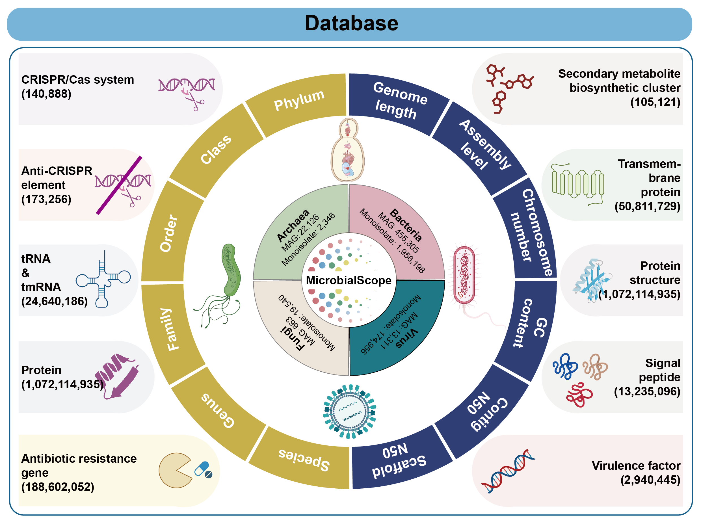

# Welcome to MicrobialScope

[MicrobialScope](https://microbial.deepomics.org/) is an online microbial database, including 2,671,718 microorganisms sequences with comprehensive annotations. 

## Database

We have collected the genomes of bacteria, archaea, fungi, and viruses, including both monoisolate genomes collected from NCBI RefSeq & GenBank and metagenome-assembled genomes (MAGs) derived from multiple metagenomic datasets. As a result, we have integrated a dataset comprising 1,963,557 bacterial, 2,555 archaeal, 19,610 fungal, and 171,014 viral genomes from monoisolate assemblies, as well as 458,869 bacterial, 22,451 archaeal, 683 fungal, and 13,321 viral MAGs. 

To provide comprehensive and accurate annotations for the microbial database, we meticulously collected and curated microbial taxonomic data along with sequence information, employing over 10 state-of-the-art bioinformatics tools to perform structural annotation (ORFs, tRNA, tmRNA, CRISPR/Cas systems and antiCRISPR systems), functional annotation (virulence factors, antibiotic resistance genes, signal peptides, transmembrane proteins and Secondary metabolite), and protein structure prediction for the microorganisms. 

